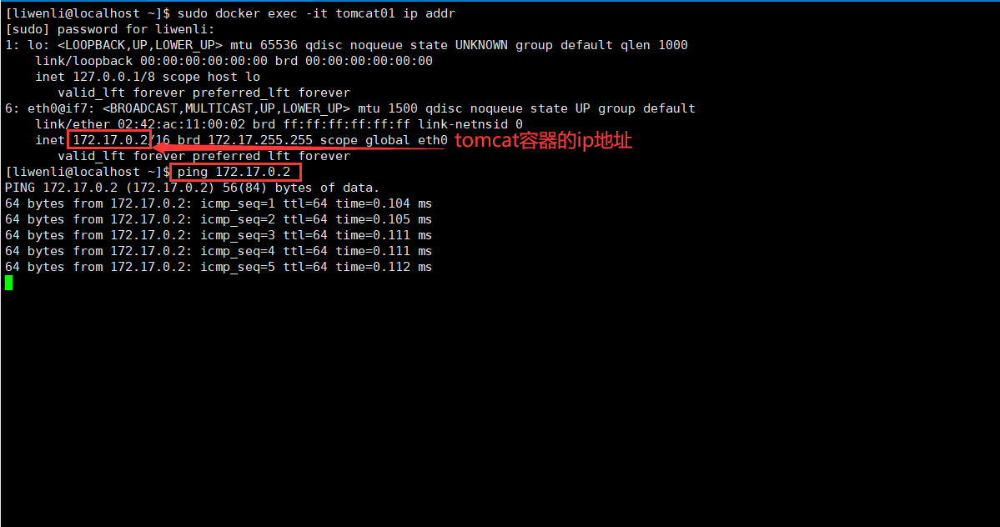
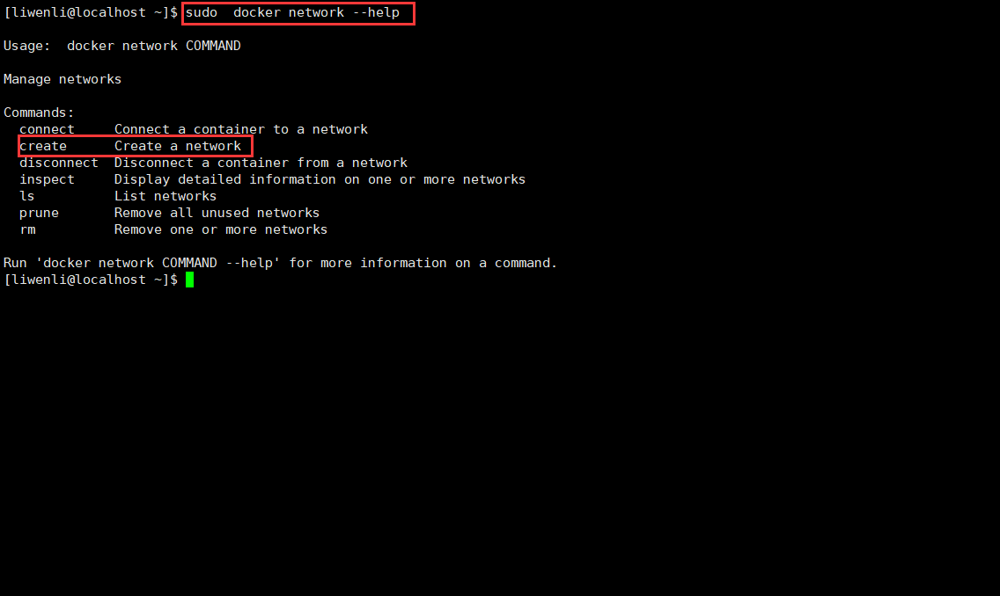

#1.换源
* 由于CentOS 8主要使用AppStream, BaseOS, Extras, epel三个仓库，所以在这里主要配置上面三个仓库对应的配置文件，这里的三个仓库可以理解为同一个软件源中保存了不同种类软件的不同部分。

##修改AppStream库
```
sudo vim /etc/yum.repos.d/CentOS-AppStream.repo

```
注释掉mirrorlist所在行，消除对baseurl的注释，并将baseurl后面的地址改为阿里云中对应的AppStream库地址。保存退出。
```
#mirrorlist=http://mirrorlist.centos.org/?release=$releasever&arch=$basearch&repo=AppStream&infra=$infra
baseurl=https://mirrors.aliyun.com/centos/8.2.2004/AppStream/x86_64/os/
```


##修改BaseOS库
```
vim /etc/yum.repos.d/CentOS-Base.repo 
```
注释掉mirrorlist所在行，消除对baseurl的注释，并将baseurl后面的地址改为阿里云中对应的BaseOS库地址。保存退出。
```
#mirrorlist=http://mirrorlist.centos.org/?release=$releasever&arch=$basearch&repo=BaseOS&infra=$infra
baseurl=https://mirrors.aliyun.com/centos/8.2.2004/BaseOS/x86_64/os/
```


##修改Extra库
```
vim /etc/yum.repos.d/CentOS-Extras.repo
```
注释掉mirrorlist所在行，消除对baseurl的注释，并将baseurl后面的地址改为阿里云中对应的extras库地址。保存退出。
```
#mirrorlist=http://mirrorlist.centos.org/?release=$releasever&arch=$basearch&repo=extras&infra=$infra
baseurl=https://mirrors.aliyun.com/centos/8.2.2004/extras/x86_64/os/
```


##更新
```
sudo yum update
```

##下载更改epel库
1.安装epel源，安装后，在/etc/yum.repos.d目录下会多出几个epel文件
```
yum install -y https://mirrors.aliyun.com/epel/epel-release-latest-8.noarch.rpm

```
2.将 repo 配置中的地址替换为阿里云镜像站地址

* 下面用sed命令来直接更改EPEL的地址是最高效的，当然也可直接用vim打开文件来改。
```
sed -i 's|^#baseurl=https://download.fedoraproject.org/pub|baseurl=https://mirrors.aliyun.com|' /etc/yum.repos.d/epel*
sed -i 's|^metalink|#metalink|' /etc/yum.repos.d/epel*
```

#docker
##一、安装dockers
* 基于centos 8 的普通用户

1.卸载旧版本

```
$ sudo yum remove docker \
                  docker-client \
                  docker-client-latest \
                  docker-common \
                  docker-latest \
                  docker-latest-logrotate \
                  docker-logrotate \
                  docker-engine
```
2.安装yum-utils软件包（提供yum-config-manager 实用程序）并设置稳定的存储库。

```
sudo yum install -y yum-utils

sudo yum-config-manager  --add-repo   https://download.docker.com/linux/centos/docker-ce.repo

```

3.更新软件包索引
```
#不需要！
sudo yum makecache
```
4.先装新版的 containerd.io
```
//不需要！
sudo dnf install https://download.docker.com/linux/centos/7/x86_64/stable/Packages/containerd.io-1.2.6-3.3.el7.x86_64.rpm
```

5.安装最新版本的Docker Engine和容器

```
//docker-ce表示下载的是社区版
sudo yum install docker-ce docker-ce-cli containerd.io
```

6.查看docker版本
```
sudo docker --version
```


7.启动docker
```
sudo systemctl start docker
```

8.重启docker服务器
```
sudo systemctl restart docker
```

9.开机自启
```
sudo systemctl enable docker
```
10.查看docker版本
```
//没有两个短横线
sudo docker version
```


##二、阿里云容器镜像服务
（1）登录阿里云账号

（2）在阿里云账号管理中搜索容器镜像服务


（3）在容器镜像服务中点击镜像加速器


（4）linux中执行以下命令
```
sudo mkdir -p /etc/docker
sudo tee /etc/docker/daemon.json <<-'EOF'
{
  "registry-mirrors": ["https://bakwgtaq.mirror.aliyuncs.com"]
}
EOF
sudo systemctl daemon-reload
sudo systemctl restart docker
```


##三、docker工作原理
```
sudo docker run hello-world
```


###运行hello-world镜像流程图


###底层原理，端口映射
* Docker是一个Client-Server结构的系统，Docker的守护进程运行在主机上，通过Socket从客户端访问!
Docker-Server接收到Docker-Client的指令，就会执行这个命令!


###docker和vm
* docker有着比vm更少的抽象层
* docker利用的是宿主机的内核，vm需要是Guest OS
* docker新建一个容器的时候，不需要像虛拟机一样重新加载一个操作系统内核。虚拟机是加载Guest OS，而docker是利用宿主机的操作系统，省略了系统引导这个复杂的过程


##三、帮助
```
sudo docker --help
```


```
sudo docker images --help

```


```
sudo docker search --help

```


##四、镜像命令
####1.查看所有镜像
```
sudo docker images
```


```
//images的帮助
sudo docker images --help

```


```
//显示所有的镜像信息
sudo docker images -a  
```


```
//只显示镜像的id
sudo docker images -q
```


####2.搜索镜像命令
```
sudo docker search name
```

```
//查找mysql软件
sudo docker search mysql
```


####3.拉取镜像
```
sudo docker pull name

```
* 不指定版本下载镜像
```
//如果不指定mysql 的tag，那么默认是下载最新版本的mysql
sudo docker pull mysql

```


```
sudo docker pull ubuntu

```


```
sudo docker pull centos

```


* 指定版本下载
```
//下载5.7版本的mysql,版本一定要dockerhub提供！！
sudo docker pull mysql:5.7

```


####4.查看下载的镜像
```
sudo docker images
```


####5.删除镜像
* 通过镜像id移除镜像
```
//rm表示remove , i表示images, -f表示force , id表示软件镜像id
sudo docker rmi -f 镜像id
```

```
sudo docker rmi -f mysql(移除最新的mysql镜像)
```


```
sudo docker rmi -f mysql:5.7(mysql 5.7的镜像id)
```


##五、容器命令
* 有了镜像才可以创建容器，比如我们拉取了一个ubuntu的镜像，那么我们可以创建一个容器运行ubuntu。
```
sudo docker pull ubuntu
```
```
sudo docker pull centos
```
####1.创建容器并启动
```
//--it表示进入交互界面,/bin/bash进行交互
sudo docker run -it ubuntu  /bin/bash
```


```
//--it表示进入交互界面,/bin/bash进行交互
sudo docker run -it centos  /bin/bash
```


####2.容器停止退出

```
exit
```


####3.容器不停止退出(后台运行)
```
ctrl +p +q
```

####4.查看正在运行的容器(可以看见容器的id)
```
sudo docker ps

```


####5.查看正在运行的容器的id
```
sudo docker ps -q
```


####5.查看历史的运行过的容器（已经创建的容器）
```
sudo docker ps -a
```


####6.删除容器

```
sudo docker rm -f 容器id
```
```
//查看正在运行的容器id
sudo docker ps

sudo docker rm -f 43700d7d93c9

sudo docker ps
```


####7.容器的启动和停止
* run是新建一个容器(操作的是镜像)，start是启动一个已经存在的容器(操作的是容器的id)
* 当你创建并运行了exit命令，你可以通过以下启动容器命令，而不是再重新创建一个容器

（1）启动已经创建的容器
```
//查看已经创建并运行过的容器
sudo docker ps -a 
sudo docker start 容器id  //启动容器
```
```
//查看已经创建并运行过的容器
sudo docker ps -a 
//启动容器
sudo docker start 549d79c65e8d
//查看容器是否启动成功
sudo docker ps
```


（2）重启容器
```
//查看正在运行的容器
sudo docker ps
sudo docker restart 容器id  //重启容器
```
```
//查看正在运行的容器
sudo docker ps

sudo docker restart 549d79c65e8d
```


（3）停止当前容器
```
//查看正在运行的容器
sudo docker ps
sudo docker stop 容器id  //停止当前容器
sudo docker ps
```
```
//查看正在运行的容器
sudo docker ps
sudo docker stop 549d79c65e8d
sudo docker ps
```


（4）强制停止当前容器
```
//查看正在运行的容器
sudo docker ps
sudo docker kill 容器id  //强制停止当前容器
sudo docker ps
```
```
sudo docker ps
sudo docker kill 549d79c65e8d
sudo docker ps
```


##常用的其他命令
####1.后台启动容器
* 这里有一个陷阱
```
sudo docker run -d 镜像名
```
```
sudo docker run -d centos
```


* 查看一下正在运行的容器
```
sudo docker ps 
//发现centos停止了！为什么呢？？
```


* docker 容器使用后台运行，就必须要有要一个前台进程，docker 发现没有前台应用，就会自动停止。
nginx容器启动后，发现自己没有提供服务，就会立刻停止。

####2.查看日志命令
* 日志的帮助命令
```
sudo docker logs --help
```


* 显示全部日志信息
```
//-t -f表示持续显示日志，可以合在一起 -tf
sudo docker logs -t -f 容器id
或者
sudo docker logs -tf 容器id

```

```
sudo docker ps

sudo docker logs -tf 549d79c65e8d(centos的容器id)
```


* 显示10条日志信息
```
sudo docker logs -t -f --tail 10  容器id
或者
sudo docker logs -tf --tail 10  容器id

```
```
sudo docker logs -tf --tail 10 549d79c65e8d(centos的容器id)

```


####3.显示容器内的进程id
* 查看容器内部的进程id。 知道了容器内部的进程id，便可以kill容器内部的进程了
```
sudo docker top 容器id(通过sudo docker ps 命令查看的容器id)
```
```
//目的是查看容器的id
sudo docker ps 

sudo docker top 549d79c65e8d
```


####4.查看容器的元素据
```
sudo docker inspect 容器id
```

```
sudo docker inspect 549d79c65e8d(centos的容器id)
```

* 查看容器的元数据
```
//目的是查看容器的id
sudo docker ps 

sudo docker inspect 容器id
```


####5.进入当前正在后台运行的容器
（1）通过开启一个新的终端进入容器
```
//exec 表示execute
sudo docker exec -it 容器id /bin/bash
```

* 容器内部开启了一个新的进程
```
sudo docker ps 

sudo docker exec -it 549d79c65e8d  /bin/bash
```


（2）通过正在运行的终端进入容器
* 容器内部没有开启新的进程
```
//前提是有一个正在运行的终端
sudo docker attach 容器id
```

```
//前提是有一个正在运行的终端
sudo docker attach 549d79c65e8d
```
* 通过容器id进入容器
```
sudo docker ps 

sudo docker attach 549d79c65e8d
```


####6.从容器内部拷贝文件到主机
* 从主机拷贝到容器内部一般使用挂载
```
//查看docker正在运行的容器的id
sudo docker ps 
```
```
//通过开启一个新的终端进入容器内部
sudo docker exec -it 549d79c65e8d /bin/bash
```
```
//在centos容器内的home目录新建一个文件
cd /home
touch liwenli.java
```
```
//容器不停止退出(后台运行)
ctrl +p +q
```
```
//查看正在运行的容器id
sudo docker ps
```
```
//将centos容器的/home下的liwenli.java文件拷贝到主机的/home目录下
sudo docker cp 549d79c65e8d:/home/liwenli.java  /home

```


##作业
###1.部署nginx
（1）搜索nginx镜像
```
sudo docker search nginx
```
（2）拉取nginx镜像
```
sudo docker pull nginx
```
（3）运行nginx镜像
```
// -d后台运行 --name给容器命名 -p宿主机端口

sudo docker run -d --name nginx01 -p 3344:80 nginx

```


（4）在nginx容器内可以通过http://container-ip:80访问

（5）虚拟机本地centos8查看3344端口
```
sudo curl localhost:3344
```


（6）本地windows通过http://虚拟机centos8的ip:3344访问
* 首先查看虚拟机centos8的ip
```
ip addr
```
```
//虚拟机centos8的ip是 192.168.177.129
2: ens33: <BROADCAST,MULTICAST,UP,LOWER_UP> mtu 1500 qdisc fq_codel state UP group default qlen 1000
    link/ether 00:0c:29:96:d9:b1 brd ff:ff:ff:ff:ff:ff
    inet 192.168.177.129/24 brd 192.168.177.255 scope global noprefixroute ens33
       valid_lft forever preferred_lft forever
    inet6 fe80::6b76:8e10:e047:a3e6/64 scope link noprefixroute 
       valid_lft forever preferred_lft forever
```
* windows打开浏览器输入虚拟机centos8的ip:3344端口
```
http://192.168.177.129:3344/
```


（7）通过新建一个终端进入nginx
```
sudo docker ps

```
```
sudo docker exec -it nginx01(nginx容器名)/bf5c2a3e921a(nginx容器id)  /bin/bash
```


（8）退出并终止nginx
```
//退出终端，但是nginx还在后台运行，也就是说我们还可以看到 sudo curl localhost:3344 的html代码
exit 
```


```
sudo docker ps
sudo docker stop nginx01(nginx容器名)/bf5c2a3e921a(nginx容器id)
//stop nginx容器后就无法访问nginx了，也就是说我们无法看到 sudo curl localhost:3344 tml代码了
```


（9）总结
* 通过这几步，我们已经成功的部署了一个nginx，并且可以到公网上访问

* 思考问题:我们每次改动nginx配置文件，都需要进入容器内部？十分的麻烦，我要是可以在容器外部提供一个映射路径，达到在
容器修改文件名，容器内部就可以自动修改? -v数据卷!

###2.部署tomcat:9.0
* 官方的使用方式

```
//You can test it by visiting http://container-ip:8080 in a browser or, if you need access outside the host, on port 3355
docker run -it --rm -p 3355:8080 tomcat:9.0
```
* 我们自己的使用方式

（1）查看tomcat镜像
```
sudo docker search tomcat
```


（2）拉取tomcat:9.0
```
sudo docker pull tomcat:9.0
```


（3）启动tomcat:9.0镜像
```
//-d 表示后台运行，-p表示将host端口映射，--name表示给运行的tomcat容器命名
sudo docker run -d -p 3355:8080 --name tomcat01 tomcat:9.0
//外网可以通过http://虚拟机centos8的ip:3355访问，在容器内可以通过http://container-ip:8080访问
```


* 如果没有tomcat版本号，那么docker会去dockerhub找最新的tomcat版本并运行

（4）访问测试
* 能够通过外网访问证明tomcat已经成功的部署了，但是为社么会出现404呢？？


（5）探索出现404的原因

* 出现404的原因是下载的tomcat版本是精简版，webapps里面没有资源，所以会出现404错误
```
sudo docker exec -it tomcat01 /bin/bash

ls

cd webapps

ls
```


（6）解决404问题
* 将webapps.dist目录的文件全部复制到webapps目录下，注意一定要使用-r表示递归拷贝


* 再去外网访问tomcat，会出现tomcat的欢迎界面


（7）tomcat:9.0在docker部署完成

##commit提交容器
（1）所有的Docker镜像都起始于一个基础镜像层,当进行修改或增加新的内容时,就会在当前镜像层之上,创建新的镜像层。


（2）Docker镜像都是只读的，当容器启动时，一个新的可写层被加载到镜像的顶部! 这一层就是我们通常说的容器层，容器之下的都叫镜像层!


（3）提交容器成为一个新的镜像副本
````
sudo docker commit -m="提交的描述信息" -a="作者" 容器id 目标镜像名:[tag]
````

```
sudo docker commit -m="add webapps" -a="liwenli" 683a2c0c2078 tomcat:1.0

```


（4）总结
* 启动一个默认的tomcat
* 发现这个默认的tomcat是没有webapps应用，官方的镜像默认webapps下面是没有文件的!
* 自己将webapps.dist中的文件拷贝到webapps目录下
* 将操作过的容器通过commit提交为一个新的tomcat镜像!以后使用自己修改过的镜像即可，这就是自己的一个修改的tomcat镜像

##容器数据卷

###Docker的理念回顾
将应用和环境打包成一个镜像！数据？ 如果数据都在容器中，那么我们容器删除，数据就会丢失！需求：数据可以持久化
MySQL容器删了，删库跑路！需求：MySQL数据可以存储在本地！
容器之间可以有一个数据共享的技术！Docker容器中产生的数据同步到本地！
这就是卷技术！目录的挂载！将我们容器内的目录挂载到linux系统上。
总结：容器数据卷就是为了实现容器的持久化和同步操作，容器间也是可以数据共享的
好处：我们以后修改只需要在本地修改即可，容器内会自动同步！


###直接使用命令挂载

1.使用-v命令挂载
```
sudo docker run -it -v 主机目录:容器内目录
```
```
sudo docker run -it -v /home/liwenli/centoshome:/home centos /bin/bash

```


2.查看是否挂载成功
```
sudo docker ps
sudo docker inspect dc26736f2dc8
```


###mysql同步数据
（1）搜索镜像
```
sudo docker search mysql
```


（2）拉取镜像
```
sudo docker pull mysql
```


（3）docker官方安装
```
//官方没有进行数据挂载
sudo docker run -p 3310:3306  --name mysql01  -e MYSQL_ROOT_PASSWORD=liwenli -d mysql
```

（4）准备
* 我们首先要知道挂载数据卷的时候主机的目录的优先级是高于容器目录的，那么当我们的主机目录为空的时候容器的目录也会同步为空，这样就破坏了mysql文件。
所以我们要先将mysql要挂载的目录里面的所有文件和目录先拷贝到主机目录下，这样就不会破坏mysql被挂载的目录文件了！！


（5）创建新的mysql容器并挂载数据卷
```
//-d后台运行  -p端口映射  -V卷挂载   -e环境配置  --name容器名字

sudo docker run -d -p 3311:3306 -v /home/liwenli/mysql/conf:/etc/mysql/conf.d -v /home/liwenli/mysql/data:/var/lib/mysql --name mysql02 -e MYSQL_ROOT_PASSWORD=liwenli -d mysql
```

（6）连接mysql数据库

```
//查看虚拟机ip
sudo ip addr 
```


```
//关闭虚拟机的防火墙，或者将3310，3311端口打开
sudo systemctl stop firewalld

//查看防火墙状态
sudo systemctl status firewalld
```


```
windows 中进行远程连接
```


（7）总结
* navicat-连接到服务器的3311 --- 3311 和容器内的3306映射，这个时候我们就可以连接上虚拟机里面docker部署的mysql服务器了!

（8）补充
* 使用数据卷挂载后，mysql容器里面的数据和本机的数据是相互隔离的，也就是说我们删除了mysql容器不会影响到宿主机目录里面的数据，这样就实现了mysql容器数据的持久化，不丢失！！！


###具名挂载和匿名挂载

如何确定是具名挂载、匿名挂载还是指定路径挂载！！

####1.匿名挂载
（1）创建容器并匿名挂载
```
-v 容器内路径 #匿名挂载
```
```
sudo docker run -d -p 3388:80 --name nginx02 -v /etc/nginx nginx

```


（2）查看挂载情况
```
sudo docker volume ls

```


####2.具名挂载
（1）创建容器并具名挂载
```
-v 卷名:容器内路径 #具名挂载

```
```
sudo docker run -d -p 3399:80 --name nginx03 -v juming-nginx:/etc/nginx nginx
```


（2）查看挂载情况
```
sudo docker volume ls
```


####3.指定路径挂载
（1）准备
* 先将nginx容器中的/etc/nginx目录下面的所有文件拷贝到主机的/home/liwenli/nginx目录下


（1）创建容器并指定路径挂载
```
-v /宿主机路径:容器内路径 #指定路径挂载!
```
```
sudo docker run -d -p 3377:80 --name nginx04 -v /home/liwenli/nginx:/etc/nginx nginx

```


（2）查看挂载情况
```
sudo docker volume ls
```


####4.挂载卷存放位置
（1）匿名挂载
```
sudo docker volume ls

```
```
sudo docker volume inspect 4934e57d2780b093fc0c19ac496e1d2ad1df14abfd3c301e3ff77dfba5109647
```


（2）具名挂载存放位置
```
sudo docker volume ls

```
```
sudo docker volume inspect juming-nginx
```


（3）指定位置存放
```
sudo docker ps 

sudo docker inspect nginx04

```


####5.拓展

通过-v容器内路径ro、rw改变读写权限
```
ro     readonly #只读
rw     readwrite # 可读可写

```
一旦这个了设置了容器权限，容器对我们挂载出来的内容就有限定了!
```
docker run -d -p 3333:80 --name nginx05 -v juming-nginx:/etc/nginx:ro nginx
docker run -d -p 3333:80 --name nginx05 -v juming-nginx:/etc/nginx:rw nginx
```
只要看到ro就说明这个路径只能通过宿主机来操作，容器内部是无法操作!


###通过DockerFile挂载
* 先制作一个centos镜像

（1）创建一个目录

```
//在/home/liwenli/目录下新建一个docker-volumes目录
mkdir docker-volumes
```


（2）编写制作镜像的构建文件

* docker镜像构建文件dockerfile中，以'#' 开头的一行将被视为注释，出现在其他位置视为参数。也就不难理解报错原因：将写在同一行的注释视为参数了。
```
vim dockerfile 
```
```

#Dockerfile是一个用来构建docker镜像的构建文件
#基础镜像
FROM centos
#匿名挂载数据卷
VOLUME ["volume01","volume02"]
#进入控制台
CMD /bin/bash


```


（3）执行镜像构建文件
```
//-f（file）表示docker镜像构建文件名  -t（target）表示目标的docker镜像名  最后有一个"."不要少!!
sudo docker build -f dockerfile -t liwenli-centos .

```

（4）查看生成的镜像
```
sudo docker images
```


（5）启动镜像
```
sudo docker run -it 5aaae513b625 /bin/bash
```


（6）查看挂载情况
```
sudo docker ps 
sudo docker inspect 3b87b6c266c3
```


（7）查看是否可以同步
* 在centos容器里面创建文件，主机能够同步


* 在主机里面修改文件，centos容器里面能够同步


###数据卷容器
####（1）基本知识


####（2）创建一个父容器centos01
```
sudo docker run -it --name centos01 liwenli-centos
```

####（3）创建一个子容器centos02
```
sudo docker run -it --name centos02 --volumes-from centos01 liwenli-centos
```


####（4）检测同步情况
* centos01中的volume01中创建的centos01.java在centos02中的volume01中能够同步


* centos02中的volume01中创建的centos02.java在centos01中的volume01中能够同步


* 总结，数据卷容器能够实现容器之间的数据共享
####（5）探究数据卷容器共享数据的根本原因
* centos01和centos02的volume01，volume02分别挂载在宿主机的同一个目录下，所以能够实现数据共享！


##DockerFile构建镜像
* Dockerfile 是用来构建自定义 Docker 镜像的文本文档
###基础知识


####1. 前言

Dockerfile 是用来构建自定义 Docker 镜像的文本文档。我们通过docker build 命令用于从Dockerfile 文件构建镜像。 如果你要构建自定义镜像，Dockerfile 是你必须学会的技能之一。
####2. Dockerfile 的基本结构

Dockerfile 一般分为：基础镜像、镜像元信息、镜像操作指令和容器启动时执行指令，# 为 Dockerfile 中的注释。以'#' 开头的一行将被视为注释，出现在其他位置视为参数，写在同一行的注释视为参数。

 ####3. Dockerfile 文件说明

 Docker 从上到下的顺序运行Dockerfile 的指令，每一个指令都以 step 为步骤。而且文件的命名也必须为 Dockerfile

####4. Dockerfile 常用的指令。
（1）FROM #FROM是指定基础镜像，必须为第一个命令
```
FROM <image>:<tag>
```
```
FROM busybox:$VERSION
```

（2）MAINTAINER #MAINTAINER 用来声明维护者信息，该命令已经过期，推荐使用 LABEL(deprecated不推荐)
```
LABEL maintainer="SvenDowideit@home.org.au"
```
（3） LABEL #LABEL 用于为镜像添加元数据，多用于声明构建信息，作者、机构、组织等
```
LABEL <key>=<value> <key>=<value> <key>=<value> ...
```
```
LABEL version="1.0" description="liwenli.cn" by="imliwenli"
```

（4）ENV #ENV 用来设置环境变量，可以通过 ${key} 在其它指令中来引用变量，如 ${MY_NAME}

```
ENV <key>=<value> ...
```
```
ENV MY_NAME="imliwenli"  MY_HOME=/home/liwenli  MY_CAT=fluffy
```
```
#指令 $key或${key}引用
ADD
COPY
ENV
EXPOSE
FROM
LABEL
STOPSIGNAL
USER
VOLUME
WORKDIR
ONBUILD
```
（5）ARG #ARG 用于指定传递给构建运行时的变量。通过 docker run 中的 --build-arg <key>=<value> 来动态赋值，不指定将使用其默认值

```
ARG <name>[=<default value>]
```
（6）WORKDIR #WORKDIR用来指定工作目录，通过WORKDIR设置工作目录后，Dockerfile 中其后的命令 RUN、CMD、ENTRYPOINT、ADD、COPY 等命令都会在该目录下执行。
在使用 docker run 运行容器时，可以通过 -w 参数覆盖构建时所设置的工作目录
```
WORKDIR <PATH>
```

（7）ADD #ADD 用于将本地文件添加到镜像中，tar 类型文件会自动解压(网络压缩资源不会被解压)，可以访问网络资源。
```
ADD [--chown=<user>:<group>] <src>... <dest>
ADD [--chown=<user>:<group>] ["<src>",... "<dest>"]
```
```
ADD --chown=55:mygroup files* /somedir/
ADD --chown=bin files* /somedir/
ADD --chown=1 files* /somedir/
ADD --chown=10:11 files* /somedir/
```

（8）COPY #COPY 的功能类似于 ADD，但是不会自动解压文件，也不能访问网络资源

```
COPY [--chown=<user>:<group>] <src>... <dest>
COPY [--chown=<user>:<group>] ["<src>",... "<dest>"]
```
```
COPY --chown=55:mygroup files* /somedir/
COPY --chown=bin files* /somedir/
COPY --chown=1 files* /somedir/
COPY --chown=10:11 files* /somedir/
```

（9）RUN #RUN 在镜像的构建过程中执行特定的命令，并生成一个中间镜像。
```
#shell格式
RUN <command>
#exec格式
RUN ["executable", "param1", "param2"]
```
```
RUN /bin/bash -c 'source $HOME/.bashrc; echo $HOME'

RUN ["/bin/bash", "-c", "echo hello"]
```
（10）CMD #CMD 构建容器后执行的命令，也就是在容器启动时才执行的命令。
与 RUN 指令的区别：RUN 在构建的时候执行，并生成一个新的镜像，CMD 在容器运行的时候执行，在构建时不进行任何操作。CMD 用于指定在容器启动时所要执行的命令，而RUN用于指定镜像构建时所要执行的命令。
多个CMD指令只有最后一个生效！

```
CMD ["executable","param1","param2"] (exec form, this is the preferred form)
CMD ["param1","param2"] (as default parameters to ENTRYPOINT)
CMD command param1 param2 (shell form)
```
```
CMD echo "This is a test."
CMD ["/usr/bin/wc","--help"]
```

（11）ENTRYPOINT #ENTRYPOINT 用来配置容器，使其可执行化。配合 CMD可省去 application，只使用参数。
```
#exec form
ENTRYPOINT ["executable", "param1", "param2"]

#shell form
ENTRYPOINT command param1 param2
```

（12） EXPOSE #EXPOSE 为构建的镜像设置监听端口，使容器在运行时监听。EXPOSE 并不会直接让容器的端口映射宿主机，需要在 docker run 时使用 -P参数，-P 参数来发布容器端口到 host 的某个端口上。
```
EXPOSE <port> [<port>/<protocol>...]
```
```
EXPOSE 80/tcp
EXPOSE 80/udp
```

（13）VOLUME #VOLUME用于指定持久化目录。VOLUME 并不会挂载到宿主机，需要通过 docker run 运行容器时通过 -v 来指定映射到宿主机的某个目录，如果不指定特定目录则默认为匿名挂载。
```
VOLUME ["/data"]，VOLUME ["/var/www", "/var/log/apache2", "/etc/apache2"]
```
```
卷可以容器间共享和重用
容器并不需要要和其它容器共享卷
修改卷后会立即生效
对卷的修改不会对镜像产生影响
卷会一直存在，直到没有任何容器在使用它

```


（14） USER 用于指定运行镜像所使用的用户或者UID。使用USER指定用户后，Dockerfile 中其后的命令 RUN、CMD、ENTRYPOINT 都将使用该用户。镜像构建完成后，通过 docker run 运行容器时，可以通过 -u 参数来覆盖所指定的用户。
```

USER <user>[:<group>]
or

USER <UID>[:<GID>]
```
```
#合法组合
USER user
USER user:group
USER uid
USER uid:gid
USER user:gid
USER uid:group
```

（15） ONBUILD #ONBUILD 当所构建的镜像被用做其它镜像的基础镜像时，该镜像中的 ONBUILD 中的命令就会触发。
```
ONBUILD <INSTRUCTION>
```
```
ONBUILD ADD . /app/src
ONBUILD RUN /usr/local/bin/python-build --dir /app/src
```

（16）SHELL #SHELL 用于设置执行命令（shell式）所使用的的默认 shell 类型。
```
SHELL ["executable", "parameters"]
```
```
#linux默认shell
SHELL ["/bin/sh", "-c"]
```

####（5）总结
* 减少镜像的图层，一个dockerfile文本不要使用多个 Label、ENV 等标签。

* 解耦复杂的应用，分成多个容器，而不是所有东西都放在一个容器内运行。如一个 Java Web 应用，可能需要 Server、DB、Cache、MQ、Log 等几个容器。


###创建tomcat镜像
####1.准备镜像文件
（1）tomcat压缩包

（2）jdk压缩包

（3）readme.txt


####2.制作tomcat镜像
（1）编写dockerfile文件，官方命名Dockerfile，build会自动寻找这个文件，就不需要-f指定dockerfile文件了!


```
#基本镜像
FROM centos

#基本镜像
FROM centos

#维护人信息，产品信息，描述信息等
LABEL version="1.0" description="tomcat Dockerfile" by="imliwenli"

#将本地（/home/liwenli/tomcat目录）的readme.txt拷贝到容器
COPY readme.txt /usr/local/readme.txt

#将本地（/home/liwenli/tomcat目录）的jdk压缩包添加到容器
ADD jdk-8u271-linux-x64.tar.gz /usr/local/

#将本地（/home/liwenli/tomcat目录）的tomcat压缩包添加到容器
ADD apache-tomcat-9.0.40.tar.gz /usr/local/

#centos镜像中没有vim包，执行安装vim的命令
RUN dnf install -y vim

#配置环境变量 
ENV LOCAL_PATH=/usr/local JAVA_HOME=/usr/local/jdk1.8.0_271 CLASS_PATH=$JAVA_HOME/lib/dt.jar:$JAVA_HOME/lib/tools.jar CATALINA_HOME=/usr/local/apache-tomcat-9.0.40 CATALINA_BASE=/usr/local/apache-tomcat-9.0.40 PATH=$PATH:JAVA_HOME/bin:$CATALINA_HOME/lib:$CATALINA_HOME/bin

#为构建的镜像设置监听端口，使容器在运行时监听
EXPOSE 80/tcp
EXPOSE 80/udp

#指定在容器启动时所要执行的命令
CMD /usr/local/apache-tomcat-9.0.40/bin/startup.sh && tail -F /usr/local/apache-tomcat-9.0.40/bin/logs/catalina.out

```

（3）构建tomcat镜像
```
#官方命名Dockerfile，不需要用-f指定dockerfile文件，docker会自己去搜索。最后的"."不要忘记！！！
sudo docker build -t imliwenli/tomcat .
```
```
[liwenli@localhost tomcat]$ sudo docker build -t imliwenli/tomcat .
Sending build context to Docker daemon  30.08MB
Sending build context to Docker daemon  154.7MB
Step 1/10 : FROM centos
 ---> 0d120b6ccaa8
Step 2/10 : LABEL version="1.0" description="tomcat Dockerfile" by="imliwenli"
 ---> Running in 2598ef142d48
Removing intermediate container 2598ef142d48
 ---> 29ab08edf44d
Step 3/10 : COPY readme.txt /usr/local/readme.txt
 ---> 9631b57eaf9c
Step 4/10 : ADD jdk-8u271-linux-x64.tar.gz /usr/local/
 ---> acc93875d6e6
Step 5/10 : ADD apache-tomcat-9.0.40.tar.gz /usr/local/
 ---> 7bf0a671cbb8
Step 6/10 : RUN dnf install -y vim
 ---> Running in 0f2019a76938
CentOS-8 - AppStream                            4.6 MB/s | 5.8 MB     00:01    
CentOS-8 - Base                                 2.0 MB/s | 2.2 MB     00:01    
CentOS-8 - Extras                                12 kB/s | 8.6 kB     00:00    
Last metadata expiration check: 0:00:01 ago on Mon Dec  7 05:34:47 2020.
Dependencies resolved.
================================================================================
 Package             Arch        Version                   Repository      Size
================================================================================
Installing:
 vim-enhanced        x86_64      2:8.0.1763-13.el8         AppStream      1.4 M
Installing dependencies:
 gpm-libs            x86_64      1.20.7-15.el8             AppStream       39 k
 vim-common          x86_64      2:8.0.1763-13.el8         AppStream      6.3 M
 vim-filesystem      noarch      2:8.0.1763-13.el8         AppStream       48 k
 which               x86_64      2.21-12.el8               BaseOS          49 k

Transaction Summary
================================================================================
Install  5 Packages

Total download size: 7.8 M
Installed size: 31 M
Downloading Packages:
(1/5): gpm-libs-1.20.7-15.el8.x86_64.rpm        192 kB/s |  39 kB     00:00    
(2/5): vim-filesystem-8.0.1763-13.el8.noarch.rp 922 kB/s |  48 kB     00:00    
(3/5): vim-enhanced-8.0.1763-13.el8.x86_64.rpm  4.9 MB/s | 1.4 MB     00:00    
(4/5): which-2.21-12.el8.x86_64.rpm             153 kB/s |  49 kB     00:00    
(5/5): vim-common-8.0.1763-13.el8.x86_64.rpm    9.3 MB/s | 6.3 MB     00:00    
--------------------------------------------------------------------------------
Total                                           4.2 MB/s | 7.8 MB     00:01     
warning: /var/cache/dnf/AppStream-02e86d1c976ab532/packages/gpm-libs-1.20.7-15.el8.x86_64.rpm: Header V3 RSA/SHA256 Signature, key ID 8483c65d: NOKEY
CentOS-8 - AppStream                            1.6 MB/s | 1.6 kB     00:00    
Importing GPG key 0x8483C65D:
 Userid     : "CentOS (CentOS Official Signing Key) <security@centos.org>"
 Fingerprint: 99DB 70FA E1D7 CE22 7FB6 4882 05B5 55B3 8483 C65D
 From       : /etc/pki/rpm-gpg/RPM-GPG-KEY-centosofficial
Key imported successfully
Running transaction check
Transaction check succeeded.
Running transaction test
Transaction test succeeded.
Running transaction
  Preparing        :                                                        1/1 
  Installing       : which-2.21-12.el8.x86_64                               1/5 
  Installing       : vim-filesystem-2:8.0.1763-13.el8.noarch                2/5 
  Installing       : vim-common-2:8.0.1763-13.el8.x86_64                    3/5 
  Installing       : gpm-libs-1.20.7-15.el8.x86_64                          4/5 
  Running scriptlet: gpm-libs-1.20.7-15.el8.x86_64                          4/5 
  Installing       : vim-enhanced-2:8.0.1763-13.el8.x86_64                  5/5 
  Running scriptlet: vim-enhanced-2:8.0.1763-13.el8.x86_64                  5/5 
  Running scriptlet: vim-common-2:8.0.1763-13.el8.x86_64                    5/5 
  Verifying        : gpm-libs-1.20.7-15.el8.x86_64                          1/5 
  Verifying        : vim-common-2:8.0.1763-13.el8.x86_64                    2/5 
  Verifying        : vim-enhanced-2:8.0.1763-13.el8.x86_64                  3/5 
  Verifying        : vim-filesystem-2:8.0.1763-13.el8.noarch                4/5 
  Verifying        : which-2.21-12.el8.x86_64                               5/5 

Installed:
  gpm-libs-1.20.7-15.el8.x86_64         vim-common-2:8.0.1763-13.el8.x86_64    
  vim-enhanced-2:8.0.1763-13.el8.x86_64 vim-filesystem-2:8.0.1763-13.el8.noarch
  which-2.21-12.el8.x86_64             

Complete!
Removing intermediate container 0f2019a76938
 ---> 8936facaa5b1
Step 7/10 : ENV LOCAL_PATH=/usr/local JAVA_HOME=/usr/local/jdk1.8.0_271 CLASS_PATH=$JAVA_HOME/lib/dt.jar:$JAVA_HOME/lib/tools.jar CATALINA_HOME=/usr/local/apache-tomcat-9.0.40 CATALINA_BASE=/usr/local/apache-tomcat-9.0.40 PATH=$PATH:JAVA_HOME/bin:$CATALINA_HOME/lib:$CATALINA_HOME/bin
 ---> Running in 72890a6ee727
Removing intermediate container 72890a6ee727
 ---> e24caca4a195
Step 8/10 : EXPOSE 80/tcp
 ---> Running in d8ce16bf3af1
Removing intermediate container d8ce16bf3af1
 ---> c73653bbab94
Step 9/10 : EXPOSE 80/udp
 ---> Running in 05d646fac435
Removing intermediate container 05d646fac435
 ---> 601c74e4fe8a
Step 10/10 : CMD /usr/local/apache-tomcat-9.0.40/bin/startup.sh && tail -F /usr/local/apache-tomcat-9.0.40/bin/logs/catalina.out
 ---> Running in a830480faa4b
Removing intermediate container a830480faa4b
 ---> 57117c891a29
Successfully built 57117c891a29
Successfully tagged imliwenli/tomcat:latest
[liwenli@localhost tomcat]$ 

```


（4）查看构建的镜像
```
sudo docker images
```


（5）创建容器
```
sudo docker run -d -p 9090:8080 --name imliwenlitomcat -v /home/liwenli/tomcat/dist/:/usr/local/apache-tomcat-9.0.40/webapps/dist -v /home/liwenli/tomcat/logs/:/usr/local/apache-tomcat-9.0.40/logs imliwenli/tomcat
```


（6）查看挂载情况


（7）测试
```
#虚拟机（localhost）内测试
sudo curl localhost:9090
```


```
#外网给测试
http://192.168.177.129:9090/
```


###发布镜像到dockerhub
####1.注册dockerhub账号
注册[dockerhub](https://hub.docker.com/signup) 账号
####2.服务器登录dockerhub
```
sudo docker login --help
```
```
sudo docker login -u imliwenli

```


####3.提交镜像到dockerhub
（1）需要严格按照如下镜像名，否则提交失败
```
#用户名/镜像名:版本号，标准方式
sudo docker push imliwenli/tomcat:tag
```
```
#用户名/镜像名，也能提交成功
sudo docker push imliwenli/tomcat
```


（2）修改镜像名
```
sudo docker tag imliwenli/tomcat imliwenli/tomcat:1.0
```


####（3）dockerhub下载镜像
```
sudo docker pull imliwenli/tomcat
```

##docker工作流程


##网络
* 因为docker 网络需要一个纯净的环境，所以我又开了一台虚拟机
###了解docker0地址
1.查看docker0地址


2.主机可以访问容器内部

（1）创建一个tomcat容器

```
sudo docker run -it -p 9090:8080  --name="tomcat01" /bin/bash imliwenli/tomcat
```


（2）查看容器的ip地址

```
sudo docker exec -it tomcat01 ip addr
```


（3）查看主机ip addr
```
ip addr
```


（4）主机能够ping容器，原因是在同一个局域网
```
ping 172.17.0.2
```


（5）原理

我们每启动一个docker容器，docker就会给docker容器分配一个ip，我们只要安装了docker，就会有一个网卡docker0
桥接模式，使用的技术是evth-pair技术！evth-pair就是一对的虚拟设备接口，他们都是成对出现的，一段连着协议，一段彼此相连 正因为有这个特性，evth-pair 充当一个桥粱，连接各种虚拟网络docker的连接。


总结：两个容器之间可以通过docker0相互ping通


* 注意：两个容器之间只能通过ip地址ping通，不能通过容器名ping通，容器要想通过容器名ping通就必须将容器部署到自己创建（自定义）的网络中。
###创建网络
####1.查看所有docker容器的网络
```
sudo docker network ls
```


####2.了解网络的模式
bridge ：桥接docker (默认)

none ：不配置网络

host ：和宿主机共享网络

####3.创建容器时候指定网络模式
（1）不指定网络默认是 --net bridge
```
#两种创建容器的网络模式都是bridge模式
sudo docker run -d -p 9090:8080 --name tomcat01 imliwenli/tomcat

sudo docker run -d -p 9090:8080 --name tomcat01 --net bridge imliwenli/tomcat
```
####4.创建一个网络
（1）查看网络帮助
```
sudo docker network --help
```


```
sudo docker network create --help
```


（2）创建网络（自定义的网络）
```
#--driver 网络模式   --subnet 子网  --gateway 网关  mynet 网络名（随意选取）
sudo docker network create --driver bridge --subnet 192.168.0.0/16 --gateway 192.168.0.1  mynet
```


（3）查看创建的网络（自定义的网络）
```
#mynet为创建的网络名
 sudo docker network inspect mynet
```


（4）将tomcat部署到创建（自定义）的网络中
```
sudo docker run -d -p 9093:8080 --name tomcat-mynet-01 --net mynet imliwenli/tomcat
sudo docker run -d -p 9094:8080 --name tomcat-mynet-02 --net mynet imliwenli/tomcat
sudo docker run -d -p 9095:8080 --name tomcat-mynet-03 --net mynet imliwenli/tomcat
```


（5）再次查看创建（自定义）的网络
```
#发现多了三个子网
 sudo docker network inspect mynet
```


（6）检验在创建（自定义）的网络中部署的容器是否可以通过ip地址 ping通
* ping ip 地址能联通
```
#192.168.0.3是omcat-mynet-02的ip地址，相当于tomcat01 ping tomcat02
sudo docker exec -it tomcat-mynet-01 ping 192.168.0.3
```


（7）检验在创建（自定义）的网络中部署的容器是否可以通过容器名 ping通
```
#两个容器可以通过容器名相互ping通
sudo docker exec -it tomcat-mynet-01 ping tomcat-mynet-02
```


（8）主机再次查看网络
```
ip addr
```


（9）自己创建的网络的好处
* 可以将网络隔离，防止干扰，常用于集群


###网络联通
（1）将一个网络的容器连接到另外一个网络的原理

* 如将docker0网络中的容器A连接到mynet网络，将docker0网络中的容器C连接到mynet02网络


（2）查看帮助文档
```
sudo docker network --help
sudo docker network connect --help
```


（3）将一个网络的容器连接到另外一个网络
```
#mynet为网络，tomcat01为docker0的一个容器
sudo docker network connect mynet tomcat01
```


（4）将docker0下面的tomcat01与网络mynet网络联通后，查看mynet网络
```
sudo docker network inspect mynet
```


（5）检验docker0网络下面的tomcat01和mynet网络是否联通

* docker0网络下面的tomcat01能不能ping通mynet网络下面的容器tomcat-mynet-01
```
sudo docker exec -it tomcat01 ping tomcat-mynet-01
```


* mynet网络下面的容器tomcat-mynet-01能不能ping通docker0网络下面的tomcat01
```
sudo docker exec -it tomcat-mynet-01 ping tomcat01
```


（6）总结
* docker0 和mynet是不能够联通的
* docker0 下面的容器是可以通过connect联通mynet网络的
* 其实就是一个容器两个ip，即tomcat01既属于docker0网络，也属于mynet网络
